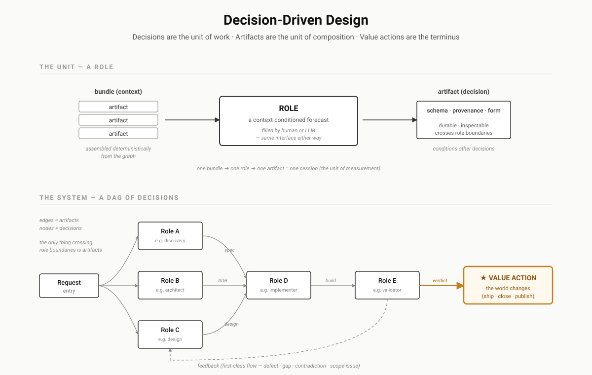

# Decision-Driven Design

**A framework for LLM systems that uses precision to create transparency — to earn trust.**

Autonomous LLM systems will be trusted the way anything is trusted: through precise agreements, kept transparently. There is no trust without both. A precise agreement about LLM work is possible because of one law:

> **The conservation of specification.** For a given task at a given assurance level, the amount of specification required is constant. Every system allocates it fully across four stores: **encoded** upstream (schema, prompt, context, model binding — paid once, amortized), **mechanical verification** (specification applied at the end instead of the beginning), **judgment** (a human head — the spec exists, unencoded, paid per run), and **escaped** (unallocated — shipped to the user as defect exposure). Nothing is ever removed from the total; it is only moved between stores.

The law is what makes the agreement precise. For any piece of work, the four stores are the terms: *this* is encoded, *this* is mechanically verified, *this* is a named human's judgment, and nothing escapes unpriced. Transparency is the same terms kept inspectable — every decision recorded, every action traceable to one. Trust is then not a feeling about the model; it is an audit of an allocation. The law tells you what the agreement must contain in any given context; the framework is the machinery for writing that agreement down and keeping it: [the head of §1](docs/01-foundations.md#the-conservation-of-specification) states the law, the [Completeness Exercise](docs/08-completeness-exercise.md) measures the allocation, and the [Polanyi floor](docs/09-the-polanyi-floor.md) bounds what any agreement can promise.

Real organizational work is a graph of decisions terminating in value actions, not a single agent loop. DDD names every piece — roles, artifacts, sessions, audits — and gives each one a measurable path from human-checkpointed to fully autonomous, a path whose ceiling is itself measured, not asserted.

---

## The premise

LLMs are knowledge forecasters. Given a context, they predict what comes next. Humans work the same way — we reach decisions by forecasting from the knowledge we hold and the context we're operating in. A work process (sales, design, research, engineering) is a chain of context-conditioned decisions that eventually produces something the world cares about.

Most current LLM agent design treats the **tool call** as the primary output unit: an agent reasons, then acts. Decision-Driven Design inverts this. The **decision** is the unit. Tool calls — the moments the world actually changes — sit only at the terminal nodes of a graph of decisions, and most of the engineering work is upstream of them.

This isn't a refinement of agentic design. It's a different geometry.

## The shift

| | Agent-centric design | Decision-Driven Design |
|---|---|---|
| **Primary unit** | The tool call | [The decision](docs/01-foundations.md#two-graphs-artifacts-and-decisions) |
| **System shape** | An agent loop | A [DAG](docs/glossary.md#dag--directed-acyclic-graph) of roles |
| **Role boundary** | "The agent" | Many roles, swappable |
| **Composition** | Tool wrapping | Artifacts with schemas |
| **What's audited** | The trajectory | Each session, each bundle, each artifact, each decision |
| **Where humans fit** | Approval at the end | Any role, any checkpoint, per-role autonomy |
| **Failure mode** | Opaque | Localized to a role and a bundle |

The point is not that agent loops are wrong — they are one valid node in the graph. The point is that for real organizational work, the graph upstream of the loop is most of the engineering, and treating it as first-class is what makes the resulting system bounded, auditable, and improvable.

## Two graphs

The DAG above is the **artifact graph** — what was produced, by which session, from what inputs. It is the lineage existing provenance vocabularies already capture, and for a process run by humans it is the whole of the recoverable record, because the decisions themselves lived in people's heads.

An LLM-run process breaks that limitation. When a worker fills a role, its decisions are made against a recorded bundle in a recorded session — the reasoning is no longer ambient. A system that records only the artifact graph throws away exactly the half that became newly recordable because a machine made the call. So DDD makes a second graph first-class: the **decision graph**.

The two graphs are different shapes over the same work, and they **intersect at the session** — the production event is the shared node. A process is *provenance-complete* only when a value-anchored artifact can be walked backward through both: through the artifact graph to its chain of upstream artifacts, and through the decision graph to its chain of upstream decisions. Recording both is what full provenance means for a system that decides.

## Why it matters now

Industrial automation was good at the value action itself — the assembly, the transaction, the routing — and the upstream decisions were a human bottleneck the factory couldn't touch. In knowledge work the action and the decision often collapse into the same step ("send this email" is both), and the chain of decisions upstream is most of the work. Factory automation couldn't help with that because it couldn't decide. LLMs can.

The dominant "AI factory" framing reaches for assembly lines and workstations: discrete tasks, deterministic flow, machines that execute. That metaphor fits when the answer is known and the goal is throughput. It fits poorly when the goal is to *decide*, because decisions are shaped by which context arrives and in what form — not by repeatable mechanical steps.

Decision-Driven Design is what comes after the factory metaphor stops being useful.

---

## Status of this document

This is a working specification of Decision-Driven Design, organized in the shape of a [W3C/RFC-style spec](https://www.rfc-editor.org/rfc/rfc7322): a motivation, a normative core, informative companions, and worked non-normative examples. It captures the framework as it currently stands; revisions follow the discipline the framework describes, and the specification is versioned alongside the reference implementations it constrains.

Open questions — places where the design will likely shift as the reference implementation contacts reality — live at the end of [§4 Conformance capabilities](docs/04-implementation.md).

This is not a product, and it is not a methodology being marketed. It is a specification of a way to build with LLMs, written for people who want to build the same way.

## Structure of this specification

| § | Document | Status |
|---|---|---|
| §1 | [Introduction and motivation](docs/01-foundations.md) | Informative |
| §2 | [Terminology and entity reference](docs/02-entity-reference.md) | **Normative** |
| §3 | [Autonomy mapping](docs/03-autonomy-levels.md) | Informative |
| §4 | [Conformance capabilities](docs/04-implementation.md) | **Normative** |
| §5 | [Application method](docs/06-applying.md) | Informative |
| §6 | [The Completeness Exercise](docs/08-completeness-exercise.md) | **Normative** |
| App. A | [Notation profile](docs/05-notation.md) | Informative |
| App. B | [Design rationale — the biology contrast](docs/07-biology-contrast.md) | Informative |
| App. C | [Glossary of borrowed terms](docs/glossary.md) | Informative |
| App. D | [The Polanyi floor](docs/09-the-polanyi-floor.md) | Informative |
| — | [Non-normative examples](applications/) | Informative |

**Normative** sections define what a system must provide to claim conformance to DDD: the vocabulary used to describe it (§2), the capabilities required to support that vocabulary in implementation (§4), and the completeness exercise a specification must pass for its pinned consumer (§6). **Informative** sections motivate, explain, illustrate, or otherwise serve the normative core, but do not themselves constrain implementations.

> Borrowed terms (DAG, DMN, RDF, MCP, OCI, …) are defined in [Appendix C: Glossary](docs/glossary.md) — open it in a side tab if any of those acronyms are unfamiliar.

## Recommended reading order

The sections build on each other. Read them in order if you're new to the framework, or jump to whichever question you're answering. The first two establish the framework; **§5 and Appendix A are a modeling toolkit** (how to derive a model, and how to draw the result) that builds directly on §2; §3 and §4 cover autonomy and implementation.

### [§1. Introduction and motivation](docs/01-foundations.md) — *informative* — *start here*

The framework's premise and core ideas. LLMs as forecasters; work as a chain of context-conditioned decisions; value actions as the terminus; roles and artifacts as the unit of organization and composition; the DAG, not the pipeline; the two graphs (artifact and decision) that meet at the session; the conservation of specification and its two projections — the funnel principle that ties model capability to constraint density along a chain, and maturation that converts recurring judgment into catalog structure over time. About 12 pages. Read this first.

### [§2. Terminology and entity reference](docs/02-entity-reference.md) — *normative*

The framework's vocabulary, made precise. Processes, decisions, actions, interpretations, roles, artifacts, sessions, schemas, bundles, audits, the orchestration system, feedback as a first-class flow class, action-interpretation pairing, per-role autonomy levels. The reference you come back to once you've internalized the foundations. Anything claiming DDD conformance uses these entities as defined here.

### [§3. The five levels of AI autonomy](docs/03-autonomy-levels.md) — *informative*

How the framework maps to the standard 0–5 autonomy ladder, why autonomy is per-role rather than per-system, and why DDD is the structure that makes Levels 4 and 5 actually reachable rather than aspirational. The destination-grammar conversation; useful when talking to people who already think in autonomy levels.

### [§4. Conformance capabilities](docs/04-implementation.md) — *normative*

The architecture for actually building a DDD-shaped system, framed by the *capabilities* it requires — artifact graph, declarative queries, shape constraints, provenance model, session-scoped lineage, durable event substrate — rather than the products that supply them. A concrete reference-implementation stack (Rust + Oxigraph + SHACL + PROV-O + Python LLM workers) is called out where it shaped the design, but the patterns are meant to survive specific technology choices. Covers bundle assembly, the worker contract, emergent-decisions-during-action, the meta-loop, per-component autonomy, and the model and prompt catalogs. Read this when you want to build something.

### [§6. The Completeness Exercise](docs/08-completeness-exercise.md) — *normative*

Conformance says a specification is legal; completeness says it is sufficient for its pinned consumer. complete(spec, binding), the three exercise tiers, the residual with per-axis attribution, eight ordinary failure cases, and the normative definition of *projected*/*reported* application status. Read this to understand what the framework can actually promise — and how the promise is checked.

### [§5. Application method](docs/06-applying.md) — *informative*

The method: pick one value action, walk backward one hop at a time, and let artifacts, roles, and decisions fall out of three questions asked at each node. Covers the identification heuristics (what counts as an artifact, a role, a decision, a sensing action), where to stop, how gates and gating processes reveal themselves, and how feedback edges are derived. Worked end-to-end on a hiring process. Read this when you want to map your own process.

### [Appendix A. Notation profile](docs/05-notation.md) — *informative*

A design language for drawing decision graphs, roles, artifacts, and systems. Not a new UML — a thin profile over three established notations (DMN decision-requirement diagrams, BPMN lanes, C4), rendered as Mermaid so every diagram renders, diffs, and is authored as text. Introduces no new framework entities; it supplies glyphs for the ones the Entity Reference already defines, including the ready/done convergence gates. Read this when you want to draw a DDD model.

### [Appendix B. Design rationale — the biology contrast](docs/07-biology-contrast.md) — *informative*

Why DDD doesn't model the harness as a body. The biology metaphor — brain + drives + embodiment — is appealing once you frame the LLM as a forecaster, but biological drives exist to solve a regulatory problem whose preconditions (persistence, embodiment, scarcity, continuity) are exactly what DDD's stateless-session architecture removes. A companion piece, useful for sharpening what DDD chooses *not* to be and for diagnosing implicit drives sneaking into a system.

### [Appendix C. Glossary of borrowed terms](docs/glossary.md) — *informative*

Short definitions for the terms the docs use but don't define, because they come from outside the framework: DAG, DMN/DRD, BPMN, C4, Mermaid, RDF/SPARQL, SHACL, MCP, OCI, "frontier model." §2 covers DDD's own vocabulary; this appendix covers everything the docs *reference* from established work elsewhere.

### [Appendix D. The Polanyi floor](docs/09-the-polanyi-floor.md) — *informative*

The empirical boundary of what can be encoded: mapped, never denied. Why a mature task type's judgment store converges to its floor, why the maturation curve has an asymptote, and why every task type has a measured autonomy ceiling rather than an asserted one.

---

## Reference implementations

Work-in-progress reference implementations:

- **[github.com/Hafeok/product-cli](https://github.com/Hafeok/product-cli)** — the system implementation for the Engineering process. Owns features, ADRs, test criteria, and dependencies; builds the derived graph; assembles curated bundles; runs audits; serves the engineering graph.
- **[github.com/Hafeok/decision-cli](https://github.com/Hafeok/decision-cli)** — the companion orchestration system, being designed against the patterns in §4.

## Non-normative examples

Worked applications of DDD to concrete domains live in [`/applications`](applications). The numbered sections above define the framework in the abstract; `/applications` takes a real domain and traces it through end to end — processes, roles, artifacts, task decomposition, the points where the domain pushes back. An application is *use*, not theory; when applying it forces new general claims, they are promoted into the specification and the application references them.

Each application is marked *projected* (clean derivation, not yet exercised by a running system) or *reported* (something a real system has actually run), because a framework in love with its own generality is a failure mode. The status vocabulary is defined normatively by the [Completeness Exercise](docs/08-completeness-exercise.md) tiers, as the [Application Status](docs/02-entity-reference.md#application-status) entity.

- **[The software development lifecycle](applications/sdlc.md)** — *projected.* Code generation under DDD: the steered coding agent dissolving into typed task clusters, the classify-and-dispatch gate, the broad worker as explorer-and-typifier, and the maturation toward a standard-task catalog. The first application, and the one the reference implementation is being built against.

## Discussion

Issues and discussions on this repo are open. The framework benefits from contact with other people's domains; the strongest pressure on it so far has come from trying to apply it past software development (robotics sensing, game AI), and that kind of pressure is welcome.

## License

The documents in this repository are released under the [Creative Commons Attribution 4.0 International License (CC BY 4.0)](LICENSE). You can share and adapt the material for any purpose, including commercial, with attribution.
