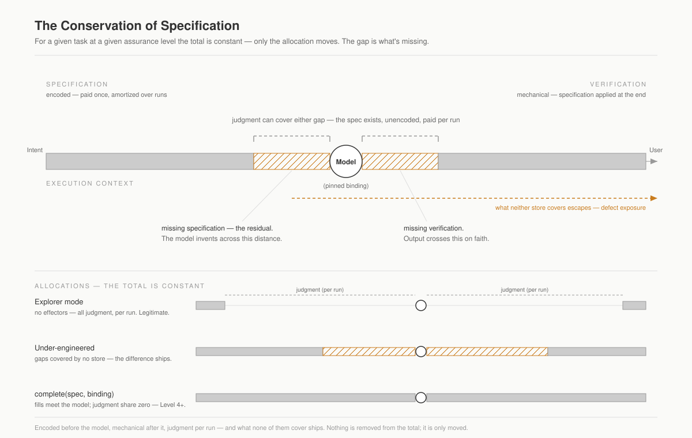

# Decision-Driven Design

**A framework for building LLM systems, resting on one law.**

Autonomous LLM systems get trusted the way anything does: through precise agreements, kept transparently. Decision-Driven Design makes both possible because it starts from a single claim about what an LLM decision *costs*.

> **Conservation of Specification.** For a given task at a given assurance level, the specification demand is constant — fixed by the task, never by the system. Every system allocates it fully across four stores: **encoded** upstream (schema, prompt, context, model binding — paid once, amortized), **mechanical verification** (specification applied at the end instead of the beginning), **judgment** (a human head — the spec exists, unencoded, paid per run), and **escaped** (unallocated — shipped to the user as defect exposure). Nothing is ever removed from the total; it is only moved between stores.

"We saved on spec *and* on review" parses as "we shipped the difference." The law turns a vague quality conversation into an allocation audit — and everything else in this repository is machinery for writing that allocation down and keeping it inspectable.

---

## The two tiers

The framework is split into two directories, and the split is the point.

### [`core/`](core/) — Decision-Driven Design itself

The law and its consequences, domain-independent. This is DDD in the abstract: *what it takes to make a decision well, and what bounds that.*

- [**The Law**](core/01-the-law.md) — conservation of specification, the environment clause (why software is *closable* and physical work is not), and the two design principles, one per boundary. **Start here.**
- [**Completeness**](core/02-completeness.md) — the instrument that reads the allocation. `complete(spec, binding)`, the three-tier exercise, the residual, eight ordinary failure cases.
- [**The Polanyi Floor**](core/03-the-polanyi-floor.md) — the lower bound: knowledge that cannot move from judgment to encoded at any effort. The autonomy ceiling, measured not asserted.
- [**The Two Projections**](core/04-projections.md) — the one law along two axes: the **funnel** (allocation over position in a chain) and **maturation** (allocation over recurrence in time).

### [`apparatus/`](apparatus/) — DDD applied

The concrete apparatus for running the law against a real domain: *how you actually build it.*

- [**Decisions, Roles, and Artifacts**](apparatus/01-decisions-and-artifacts.md) — the geometry: work as a decision graph, the inversion, the two graphs that meet at the session.
- [**Entity Reference**](apparatus/02-entities.md) — *normative.* Every entity, made precise.
- [**Encoding a Domain**](apparatus/03-encoding-the-domain.md) — context, the bundle, SPMC, phases, task types: the concrete form the encoded store takes.
- [**The Autonomy Ladder**](apparatus/04-autonomy.md) — per-role autonomy, ceilinged by the floor.
- [**Conformance Capabilities**](apparatus/05-conformance.md) — *normative.* The substrate a conformant system must provide.
- **Modeling toolkit** — [applying the method](apparatus/method/01-applying.md) (value-backward, worked on hiring) and [the notation](apparatus/method/02-notation.md) (Mermaid profile).

The relationship is strict: **`core/` is the invariant, `apparatus/` is one concrete way to keep it.** Nothing in `apparatus/` introduces a new law. When you read "the funnel is a design discipline" or "the floor is an autonomy ceiling" in the apparatus tier, those are the core law showing up in apparatus terms.

---

## The premise, in one paragraph

LLMs are knowledge forecasters: given a context, they predict what comes next. Humans work the same way. A work process — sales, design, research, engineering — is a chain of context-conditioned decisions terminating in a **value action** (a shipped feature, a closed deal, a treated patient). Most current agent design treats the **tool call** as the primary unit; DDD inverts this and treats the **decision** as the unit, with tool calls sitting only at the terminal nodes of a decision graph. This is not a refinement of agentic design — it is a different geometry, and for real organizational work the graph *upstream* of the agent loop is most of the engineering. See [apparatus §1](apparatus/01-decisions-and-artifacts.md).

## Why now

Industrial automation was good at the value action itself — the assembly, the transaction — and the upstream decisions were a human bottleneck the factory couldn't touch. In knowledge work the action and the decision often collapse into one step ("send this email" is both), and the chain of decisions upstream is most of the work. Factory automation couldn't help, because it couldn't decide. LLMs can. The dominant "AI factory" framing reaches for assembly lines: discrete tasks, deterministic flow. That fits when the answer is known and the goal is throughput; it fits poorly when the goal is to *decide.* Decision-Driven Design is what comes after the factory metaphor stops being useful.

---

## Reading order

**New to the framework?** Read `core/` top to bottom (the law, then completeness, then the floor, then the projections), then `apparatus/` §1–§3. That path takes you from *why the law holds* to *how a domain is encoded to keep it*.

**Here to build?** Skim [the law](core/01-the-law.md) and [completeness](core/02-completeness.md), then go straight to [application §2 (entities)](apparatus/02-entities.md), [§3 (encoding)](apparatus/03-encoding-the-domain.md), and [§5 (conformance)](apparatus/05-conformance.md).

**Here to map your own process?** [The law](core/01-the-law.md), then the [modeling toolkit](apparatus/method/01-applying.md).

## Normative vs. informative

**Normative** documents define what a system must provide to claim conformance: [the law](core/01-the-law.md) and [completeness](core/02-completeness.md) in core; the [entity reference](apparatus/02-entities.md) and [conformance capabilities](apparatus/05-conformance.md) in application. The [Polanyi floor](core/03-the-polanyi-floor.md) is on the normative track, currently *projected*. Everything else is **informative** — it motivates, explains, illustrates, or draws, but does not itself constrain implementations.

Status terms (*projected* / *reported*) are defined normatively by the [Completeness Exercise tiers](core/02-completeness.md#application-status-is-defined-by-these-tiers).

---

## Reference implementations

Work-in-progress:

- **[product-cli](https://github.com/Hafeok/product-cli)** — the process system for the Engineering process. Owns features, ADRs, test criteria, dependencies; builds the derived graph; assembles bundles; runs audits.
- **[decision-cli](https://github.com/Hafeok/decision-cli)** — the companion orchestration system, designed against [application §5](apparatus/05-conformance.md).

## Non-normative examples

Worked applications live in [`applications/`](applications). Each is marked *projected* (clean derivation, not yet run) or *reported* (a real system has run it), because a framework in love with its own generality is a failure mode.

- **[The software development lifecycle](applications/sdlc.md)** — *projected.* Code generation under DDD: the steered coding agent dissolving into typed task clusters, classify-and-dispatch, the broad worker as explorer-and-typifier — and the derivation frozen outward into a real ecosystem ([ai-development-foundations](https://github.com/Hafeok/ai-development-foundations), [product-framework](https://github.com/Hafeok/product-framework)).

## Discussion & license

Issues and discussions are open — the strongest pressure on the framework has come from applying it past software development. Documents are released under [CC BY 4.0](LICENSE).
