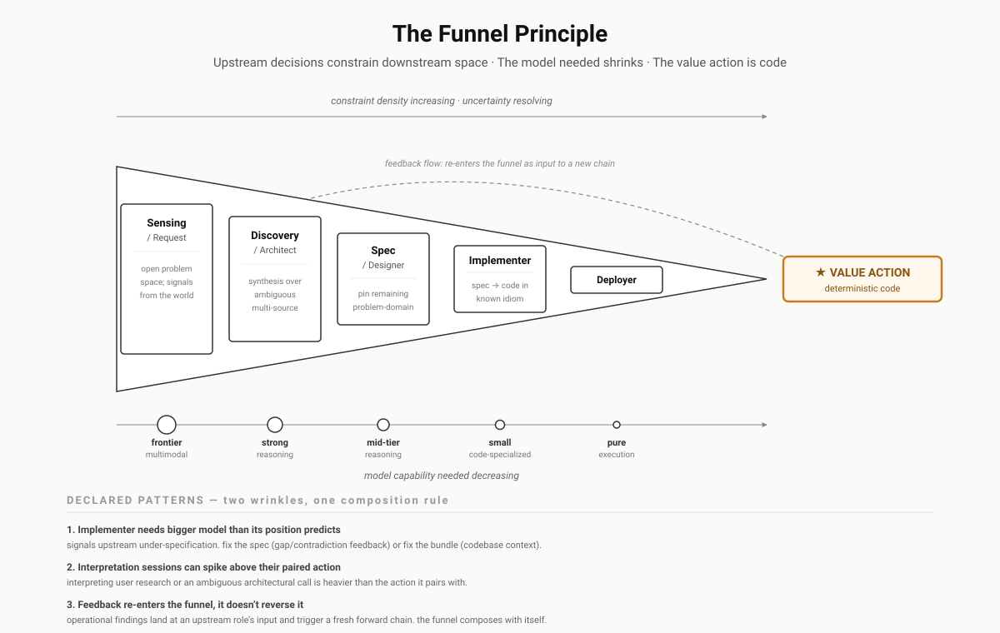
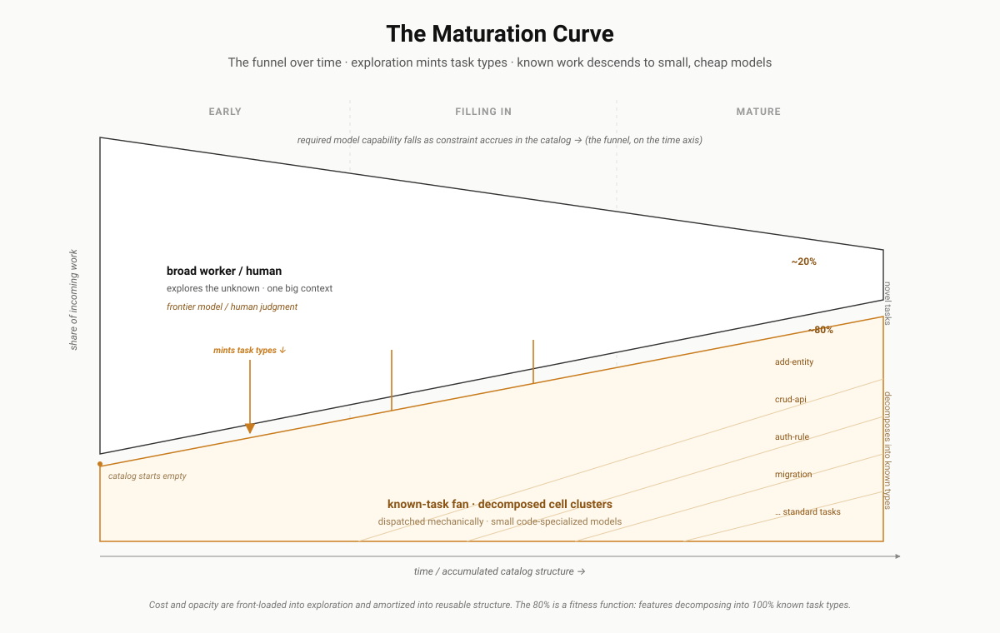

# The Two Projections: Funnel and Maturation

> **Core §4 — informative.** The [law](01-the-law.md) has two axes. Project the allocation along a chain's **position** and you get the funnel. Project it along a task type's **recurrence** in time and you get maturation. Same law, two pictures. Both are consequences, not new claims.

The law says the specification demand for a decision is constant and lives somewhere across the four stores. Two questions turn that static statement into a design discipline:

- *Along one chain of decisions, where does the encoded store grow?* → the **funnel**.
- *Across repeated runs of the same task type, where does mass move over time?* → **maturation**.

## The funnel: allocation over position

Work is a chain of decisions terminating in a value action. When the chain is well-designed, a structural pattern emerges: **constraint density rises monotonically toward the value action, and the model capability required falls correspondingly.**

Discovery works in open problem space and needs frontier reasoning. Architecture and design narrow the space through synthesis. Specifications pin the remaining problem-domain decisions. Implementation translates a well-specified problem into code in a known idiom. Deployment, at the limit, is `terraform apply`. The value action itself is deterministic code.

This *is* the encoded store growing with position. Each step downstream, more of the demand has already been allocated upstream, so the judgment and capability required of the next consumer falls. The claim is sharper than "smaller models can do simpler things": a well-designed chain **pushes hard calls upstream** so the terminus needs only execution.

**The funnel is a design discipline before it is a model-selection heuristic.** If implementation requires a frontier model, the first question is not whether the model is good enough — it is whether the spec pinned the calls that should have been pinned. When an implementer role needs a large model, the allocation at that position is *wrong*: mass is sitting in judgment that belongs in encoded.

This turns model bindings into a **forcing function on chain rigor.** Bind the implementer to a small, code-specialized model. If it fails, the first move is *upstream* — tighten the spec, enrich the input — not reach for a bigger model. The binding makes under-specification visible instead of letting it hide as model-size escalation.

Three things worth declaring rather than ignoring:

**Generative actions late in the chain.** Implementation produces a complex artifact even from a perfect spec — naming, structure, integration with existing code. Some baseline implementer judgment does not go away, because it is about the *implementation* domain, not the *problem* domain. The asymptote is not "spec encodes everything" (that is a 4GL, and it has been tried); it is "spec encodes every problem-domain decision, leaving only implementation-domain decisions to the implementer."

**Interpretation can spike.** Interpreting whether a deploy succeeded is small-model trivial. Interpreting user research or an ambiguous architectural call can need more reasoning than the action it pairs with. These are declared bumps in the funnel, not violations of it.

**Feedback composes the funnel with itself.** An operational finding does not traverse the funnel backwards on its way upstream — it lands at an upstream role's input and triggers a *fresh forward chain*. The receiving role uses its normal binding. Feedback is not counter-funnel; the funnel just composes with itself.

The design target is the bottom of the funnel: the value action should be deterministic code. Anywhere it still requires model judgment, an upstream decision was deferred into execution, and the funnel discipline pushes that judgment back where it belongs.

## Maturation: allocation over recurrence

The funnel describes one chain at one moment. The same descent happens to a *system* over time — and that is where the framework's cost curve comes from.

A unit of delivered work (a feature, a campaign, a case) is rarely one artifact. It is a composition of recurring *sub-units* — call them tasks — each itself a cluster of typed artifacts. Early in a system's life, none of these tasks are recognized. Each is open problem space, so each needs a broad, high-capability worker (or a human) to work it out from scratch. As the same tasks recur, they get **typed**: their decomposition, ordering, and quality criteria are made once and frozen into a reusable type. The next instance of a typed task inherits all that prior constraint for free and slides down to a small, cheap model.

So constraint accumulates not only along a chain (the funnel) but across time, **as catalog structure.** The hard calls migrate out of the model's live reasoning and into versioned types any model can execute against. The funnel is the spatial view of one chain constraining itself toward its terminus; maturation is the temporal view of a whole system constraining itself toward a stable architecture.

This gives a measurable definition of architectural maturity: **the fraction of incoming work that decomposes entirely into already-known types.** It rises as the type catalogs fill and falls when the system enters a new domain — an operational signal, not a vibe. The broad worker never disappears; it becomes the *explorer* that handles the novel remainder and, in doing so, mints the new types that let the next instance descend. Cost and opacity are front-loaded into exploration and amortized into reusable structure.

Its asymptote is the [Polanyi Floor](03-the-polanyi-floor.md): the maturation curve converges to (1 − floor), never to 1 — except, if the [zero-floor postulate](03-the-polanyi-floor.md#the-zero-floor-postulate-for-digital-actions) holds, for purely digital task types, whose asymptote is 1 itself. Whatever judgment remains at high recurrence is either floor content or conversion negligence, and the [diagnostic fork](03-the-polanyi-floor.md#the-convergence-result) tells them apart.

## One law, two axes

|  | Funnel | Maturation |
|---|---|---|
| Axis | position along a chain | recurrence over time |
| What grows | the encoded store, step by step toward value | the catalog, type by type |
| Failure it exposes | a downstream role needing a big model = under-specified upstream | a low known-type fraction = immature or newly-domained system |
| Instrument | [completeness](02-completeness.md) residual per seam | type-decomposability fitness metric |
| Bound | the value action is deterministic code | (1 − floor) |

Neither is a separate mechanism to build. They are two ways of *reading* the one allocation the law governs — the [Completeness Exercise](02-completeness.md) is the shared measurement instrument for both, and the [application](../apparatus/) tier is where a real domain is arranged so that both descents actually happen.
