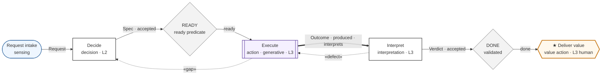
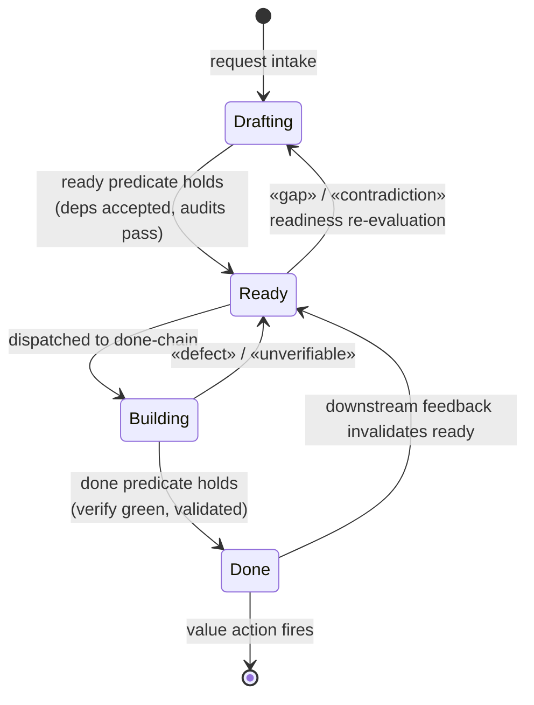
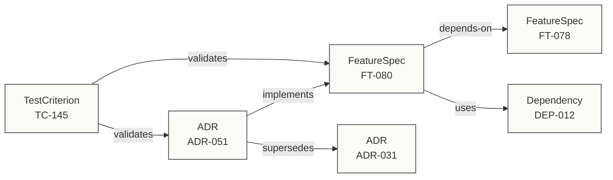

# The DDD Notation

> See the [Glossary](glossary.md) for borrowed terms (DAG, DMN, RDF, MCP, OCI, …).

A design language for drawing decision graphs, roles, artifacts, and systems — and a thin set of conventions for rendering them inside this repo.

This document does not invent a visual grammar. It borrows three established ones, redefines a small number of node semantics, and adds the handful of glyphs no standard has. The result is a profile — the way SysML is a profile of UML — not a new UML. Everything here renders as [Mermaid](https://mermaid.js.org/) in a fenced code block, which means GitHub renders it, diffs it, and lets contributors author diagrams as text rather than in a drawing tool. It is the formalization of what [`assets/overview.svg`](assets/overview.svg) already draws by hand.

## Why borrow, not invent

DDD's geometry has a few load-bearing commitments, and each maps onto an existing notation that already got that one thing right:

- **The graph is decisions, not steps.** The core view borrows the grammar of DMN's *Decision Requirements Diagram*. A DRD is already a DAG whose edges are *information-requirement dependencies, not control-flow tokens* — which is exactly the "DAG, not a pipeline" property. We keep that edge semantics and redefine the node: a DDD decision is a context-conditioned forecast performed by a role, not a decision table.
- **Roles are lanes; artifacts are what crosses them.** Where a session view genuinely needs sequence — handoffs, the action↔interpretation pairing — borrow BPMN lanes and data objects. Used sparingly, because BPMN's spine is token flow, the factory model DDD exists to leave behind.
- **Systems compose through buses.** The macro view borrows C4: each system is a container, artifact buses are the interfaces, the orchestration system is a distinguished container, and fractal nesting is just C4 levels.
- **The artifact layer is a typed graph already.** Because the substrate is RDF (Oxigraph), the truest notation for the artifact/edge/provenance layer is an ontology-style schema diagram. No invention required.

The only genuinely new glyphs are the two world boundaries (sensing and value actions), the ready/done convergence gates, feedback as a first-class flow class, and the action↔interpretation pairing. Those are a one-page profile layered on the borrowed grammars, defined below.

There is deliberately no "phase." Phases are pipeline residue — an ordering layer imposed on top of the work. In a DAG, ordering is *derived*: a node can run once the artifacts it depends on are present and in an accepted state. What replaces phases is **artifact state** plus the two convergence gates — *ready* and *done* — which the harness computes from that state. They are covered in their own section below, because securing artifact quality at those gates is what the whole flow turns on.

## The views

A DDD model is not one diagram. Like UML's diagram families or C4's levels, it is a small set of coordinated views, each answering a different question:

| View | Question it answers | Borrowed grammar | Rendering |
|---|---|---|---|
| **Decision graph** | What decisions produce what, gated where, terminating where? | DMN DRD (dependency edges) | Mermaid flowchart |
| **Artifact lifecycle** | What states does an artifact move through, and what reopens it? | UML state machine | Mermaid `stateDiagram-v2` |
| **Session & handoff** | In what order, across which roles? | BPMN lanes + data objects | Mermaid flowchart with lane subgraphs |
| **System composition** | How do systems and buses fit together? | C4 container view | Mermaid flowchart with subgraphs |
| **Artifact schema** | What are the artifact types and their typed relations? | RDF / ontology diagram | Mermaid flowchart (graph) |

The decision graph is the primary view — the heart of DDD — and most of this document is about it. The artifact-lifecycle view is its partner: the decision graph shows *who produces what*, the lifecycle view shows *when an artifact is ready to be consumed and when it is done*.

## Node vocabulary

Five node kinds — the two world boundaries, the interior decision/action pair, and the convergence gate:

| Entity | Glyph | Mermaid shape | Class | Meaning |
|---|---|---|---|---|
| **Sensing action** | rounded stadium | `([text])` | `sensing` | The input world boundary — the system reads from the world. DMN's input-data analog. |
| **Decision** | rectangle | `[text]` | `decision` | A context-conditioned forecast that produces a durable artifact. Internal. The default node. |
| **Action** | subroutine box | `[[text]]` | `action` | Execution against reality; outcome is uncertain. Annotate the flavor: `pure-execution`, `generative`, `interpretive`. |
| **Gate** | rhombus | `{text}` | `gate` | A computed convergence predicate over artifact state — the *ready* gate and the *done* gate. Mechanical: the harness evaluates it, no role decides it. That is why it is not a decision node. |
| **Value action** | hexagon, marked ★ | `{{text}}` | `value` | The terminal, external, world-changing act. The thing the organization is paid, judged, or graded on. |

An **interpretation** is a decision node (it produces a durable artifact — the reading of an outcome). It is drawn as a `decision` but is *paired* to the action it interprets by a thick link (below). Every action node should have a paired interpretation; an action with no interpretation is a modelling gap, not a shortcut.

Two annotations ride inside any node label, after a `·` separator:

- **Role** — who or what fills it. The single-interface principle holds: a lane is a lane whether a human or an LLM fills it, so the role annotation never says which.
- **Autonomy level** — `L0`–`L5`, because autonomy is per-role, not per-system.

## Edge vocabulary

| Flow | Glyph | Mermaid | Meaning |
|---|---|---|---|
| **Forward flow** | solid arrow | `-->` | An artifact moving toward a value action. The label is the artifact type. Semantics are DMN's: a *dependency* ("B requires A's artifact"), not a control token. |
| **Action↔interpretation** | thick arrow | `==>` | Pairs an action with the decision session that interprets its uncertain outcome. The label carries the produced artifact. |
| **Feedback flow** | dashed arrow | `-.->` | An artifact moving against the forward direction to condition an upstream decision. The label is the feedback class in guillemets, e.g. `«defect»`. |
| **Typed relation** *(schema view)* | solid arrow | `-->` | A typed semantic edge between artifacts: `implements`, `validates`, `supersedes`, `depends-on`. |

Feedback labels draw from the controlled vocabulary — `defect`, `gap`, `contradiction`, `unverifiable`, `undeployable`, `unimplementable`, `operational-finding`, `capability-request`, `scope-issue` — and every feedback edge is an artifact with its own lifecycle: `produced → routed → received → addressed → closed`, or `rejected` at any state with a reason. Open feedback is a tracked metric; a dropped feedback edge is a fitness-function failure.

**Artifact state rides on the forward-flow label.** An artifact does not just have a type, it has a state, and the state is what a downstream gate checks. Write it after the type with a `·`, e.g. `FeatureSpec · accepted`, `CodeChange · produced`. An edge whose artifact is not yet in the state the consumer requires is not a valid forward flow — that mismatch is exactly what the ready gate catches.

## The legend, as the smallest valid DDD diagram

The legend is itself a minimal decision graph — sense the world, decide until the work is *ready*, act, interpret, gate it *done*, deliver value, feed back:



The `classDef` block above is the canonical palette. Copy it verbatim into any DDD diagram; the colours match `assets/overview.svg`.

## Worked example: the Engineering process

The Engineering process is the one [`product-cli`](https://github.com/Hafeok/product-cli) implements. Its terminal value action is a shipped change. The roles, artifacts, and feedback classes below are the real ones from the catalog — `FeatureSpec`, `ADR`, `CodeChange`, `TestResult`, `VerificationVerdict`, and the authority-driven feedback classes — not stand-ins.

```mermaid
flowchart LR
  subgraph ENG["Engineering system"]
    direction LR
    R(["Request intake<br/>sensing"]):::sensing
    SA["Spec-author<br/>decision · L2"]:::decision
    AR["Architect<br/>decision · L2"]:::decision
    TA["Test-author<br/>decision · L2"]:::decision
    RG{"READY<br/>focal feature"}:::gate
    IM[["Implementer<br/>action · generative · L3"]]:::action
    TR[["Test-runner<br/>action · pure-execution · L4"]]:::action
    FT["Failure-triager<br/>interpretation · L3"]:::decision
    VR["Verifier<br/>decision · L2"]:::decision
    DG{"DONE<br/>verify passes"}:::gate
    SHIP{{"★ Merge &amp; ship<br/>value action · L3 human"}}:::value
  end

  R  -->|"Request"| SA
  SA -->|"FeatureSpec · accepted"| AR
  SA -->|"FeatureSpec · accepted"| RG
  AR -->|"ADR · accepted"| RG
  TA -->|"TestCriterion · implemented"| RG
  RG -->|"ready"| IM
  IM -->|"CodeChange · produced"| TR
  IM -->|"CodeChange · produced"| VR
  TR ==>|"TestResult · produced · interprets"| FT
  FT -->|"TriageNote · accepted"| VR
  VR -->|"VerificationVerdict · accepted"| DG
  DG -->|"done"| SHIP

  IM -.->|"«gap»"| SA
  IM -.->|"«contradiction»"| AR
  VR -.->|"«defect»"| IM
  VR -.->|"«unverifiable»"| SA

  classDef sensing fill:#eef6ff,stroke:#3b6ea5,stroke-width:1.5px;
  classDef decision fill:#ffffff,stroke:#333333,stroke-width:1.5px;
  classDef gate fill:#f3f3f3,stroke:#777777,stroke-width:1.3px;
  classDef action fill:#f5f0ff,stroke:#6b4ea5,stroke-width:1.5px;
  classDef value fill:#fff8ec,stroke:#c97c1e,stroke-width:2.5px;
```



Reading it the DDD way: the nodes are decisions and actions; the edges are artifacts carrying a state. The only thing crossing a role boundary is a typed artifact. The graph has two convergence gates and exactly one value action. Everything left of **READY** assembles the specification — spec, governing ADR, and test criteria converge until the ready predicate holds. Everything between READY and **DONE** is the done-chain — implement, run, triage, verify — and nothing reaches *merge & ship* until the done gate certifies it. The implementer's two dashed edges are its declared authority made visible: under-specification it cannot resolve escalates as `«gap»` to the spec-author, an internal contradiction as `«contradiction»` to the architect. Either one triggers *readiness re-evaluation* — the focal feature drops back out of ready until the upstream artifact is re-accepted. The verifier's rejection routes back as `«defect»` or `«unverifiable»` and returns the feature to building.

The gate predicates themselves are written, not drawn — a rhombus says *there is a gate here*; the contract says *what it checks*:

| Gate | Holds when | On failure |
|---|---|---|
| **READY** (focal feature) | FeatureSpec accepted · governing ADR accepted · linked TCs implemented · preflight and gap audits pass | the implementer is never dispatched; a `«gap»` or `«contradiction»` reopens the feature (readiness re-evaluation) |
| **DONE** (focal feature) | `verify` green — every linked TC passing, none failing or unrunnable · VerificationVerdict accepted | the value action is blocked; `«defect»` or `«unverifiable»` returns the feature to building |

This is the operational form of two settled commitments. *Definition of ready* is the ready predicate, and it is enforced by feedback rather than by a checklist — a role that finds its bundle insufficient emits a gap, it does not guess. *Definition of done* is the done predicate, and because validation is always a separate process, it is certified by the verifier's verdict, never self-asserted: flipping a status by hand does not satisfy it.

## Artifact state and the ready/done gates

DDD has no phases. A phase is an ordering imposed from outside the work; in a DAG the ordering is already implied by the dependency edges, and re-stating it as phases is the pipeline metaphor sneaking back in. What a process actually has is **artifacts in states**, and two computed gates over those states.

Every artifact carries a state — its schema `status`. An ADR is `proposed`, `accepted`, `superseded`, or `abandoned`; a test criterion is `unimplemented`, `implemented`, `passing`, `failing`, or `unrunnable`; and so on. These per-artifact states are the *inputs* to the gates. The gates themselves are properties of the focal artifact a chain is converging on:

- **Ready** — the focal artifact's specification is complete enough to act on. Its dependency artifacts are present and accepted, and its audits pass. This is the *definition of ready*, expressed as a predicate rather than a ceremony.
- **Done** — the focal artifact has been built and *independently validated*. This is the *definition of done*, and the independence is the point: done is certified by a separate validation role, because validation is always a separate process.

Ordering between any two pieces of work falls out of these gates: a node runs when its inputs are accepted and its ready gate holds. Nothing else sequences the graph.

The artifact-lifecycle view draws this directly. It is a UML state machine (Mermaid `stateDiagram-v2`), and its back-edges are where feedback does its work — `«gap»` and `«contradiction»` reopen readiness; `«defect»` and `«unverifiable»` reopen the build:



The `Done --> Ready` edge is what makes readiness a *stability* property rather than a one-time checkpoint: downstream feedback — an operational finding, a defect discovered in production — can invalidate a ready state that was previously satisfied, pausing dependent work until the focal artifact re-converges. The rate at which that happens is itself a fitness function.

## Cross-cutting views

Two things in DDD are orthogonal to the decision graph and need their own views.

### Domain coverage

Domains cross-cut artifacts, so they are a matrix, not a flow. The portfolio view is feature × domain; each cell is *covered* (links to coverage), *acknowledged* (non-applicable, with reasoning), or a *gap*:

| Feature | security | observability | error-handling |
|---|---|---|---|
| FT-080 | covered | covered | acknowledged |
| FT-076 | acknowledged | gap | covered |

A gap is a finding. An `acknowledged` cell carries reasoning — bare acknowledgement is rejected — because silence about a domain is indistinguishable from oversight, and the audit principle requires the negative space to be made positive.

### Artifact schema (the dual view)

The decision graph puts artifacts on the edges. The schema view inverts that: artifacts are the nodes, and the typed relations between them are the edges. This is the RDF graph the system actually stores, rendered directly.



Edges here are declared in the source artifact's representation and traversable both ways at query time. Because the substrate is a triple store, this view is not a drawing of the data — it *is* the data, projected.

## The profile extension

Everything above except the following is borrowed. These four are the parts no off-the-shelf notation has, and the only things this profile genuinely defines.

A note on scope, against the framework's own bar for additions: this profile introduces **no new framework entities** — no new decision type, flow class, or measurement class. Each item below is a *glyph* for an entity the entity reference already defines (the two world boundaries, the feedback flow class, the action–interpretation pairing, and the convergence states). The forcing function is rendering: without these glyphs there is no faithful way to *draw* a DDD model, so the diagram silently degrades into a generic flowchart that re-imports the pipeline reading. The glyphs earn their keep by catching that failure mode, not by extending the vocabulary.

1. **The two world boundaries.** Sensing actions (stadium, the input edge of the graph) and value actions (marked hexagon, the terminal edge). DMN has input data but no value action; DDD makes value actions last-class but explicit, because they are the audit anchor every subgraph must reach.
2. **Feedback as a flow class.** The dashed edge, its controlled-vocabulary label, and its lifecycle. Standard process notations treat feedback as an afterthought arrow; here it is a first-class artifact with provenance and a state machine.
3. **The action↔interpretation pairing.** The thick edge binding an action's uncertain outcome to the decision that reads it. This has no analog in BPMN or DMN; it is the structural expression of "actions produce uncertain outcomes, and the outcome must be interpreted before it conditions anything downstream."
4. **Artifact state and the ready/done gates.** The state suffix on forward-flow edges, the rhombus gate, and the ready/done predicates that gate it. The gate renders the entity reference's *convergence state* — it is not a new construct. DMN gates on data values; BPMN gates on control tokens. DDD gates on *artifact state plus passing audits*, and treats ready as a re-evaluable convergence property rather than a phase boundary. This is what replaces phases, and what secures quality before an artifact flows on.

## Authoring conventions

- Put every diagram in a fenced ` ```mermaid ` block so GitHub renders it and diffs stay readable.
- Copy the canonical `classDef` palette into each diagram. Do not restyle ad hoc.
- Keep the decision-graph invariant: **nodes are decisions and actions, edges are artifacts.** If you find yourself wanting a node for an artifact, you are drawing the schema view — switch views rather than mixing them.
- Quote any node or edge label containing punctuation (`·`, `«»`, `&`, `(`, `:`), e.g. `["Implementer<br/>action · L3"]`.
- One value action per subgraph. If a graph has two, it is two processes, and they belong in two systems with a bus between them.
- Annotate role and autonomy level on every decision and action node. Omitting the level is the same mistake as omitting a type.
- Put a state on every forward-flow artifact, and a ready/done gate wherever a chain converges. Draw a gate as a rhombus and write its predicate in a companion table — never cram the predicate into the diagram. Do not use "phase"; if you reach for it, you want a ready gate over artifact state instead.

`assets/overview.svg` is the canonical illustration of this profile; new diagrams should match its conventions rather than introduce their own, and the palette below is taken from it.
