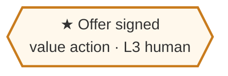
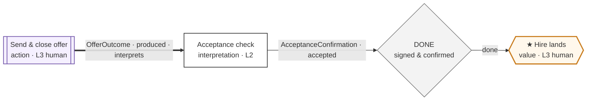
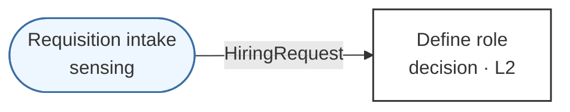

# Applying DDD to a Real Process

How to turn an actual process into a DDD model: start at the one thing the process produces, walk backward one hop at a time, and let the artifacts, roles, and decisions fall out of a small set of questions you ask at each node.

This is the companion to [the notation](05-notation.md). The notation is how you *draw* the result; this is how you *derive* it. The method is value-backward by construction — "start from what the organization actually produces, and trace back through the decisions that had to occur for it to happen" — because anchoring on the value action is what keeps the map from sprawling into everything-anyone-ever-does.

The worked example throughout is **hiring**, whose terminal value action is a signed offer. It is deliberately not the Engineering process — the point is that the same procedure produces a map for any process.

## The shape of the method

You are going to build a decision graph backward, node by node, and you stop each branch at a principled boundary. At every node you ask the same three questions, and the answers hand you the next layer:

1. **Inputs** — *what artifacts did this node need in hand?* Each answer is an incoming edge.
2. **Producer** — *for each input artifact, what decision or action produced it?* Each answer is an upstream node.
3. **Role** — *who makes that decision — what distinct bundle of context and authority?* Each answer is a role label on the node.

Then you classify the node (decision / action / sensing), pair any action with an interpretation, and check the stopping rules. Repeat until every branch terminates at a sensing action or an initial request. Then you find the gates, derive the feedback edges, and check the system boundaries.

That is the whole loop. The rest of this document is each step in detail, with the example growing under it.

## Step 0 — Pick exactly one value action

A process is *defined by* its terminal value action, so choosing the value action is choosing what process you are modelling. Pick one and run three tests on it:

- Does the organization get paid, judged, or graded on it?
- Does it cross a boundary out of the system — to a customer, a candidate, production, the public?
- If it stopped happening, would someone *outside* the team notice?

If all three hold, it is a value action. If you have two candidates that both pass, you have two processes — model them separately, and connect them later with a bus. One value action per map keeps the map honest.

> **Example.** *Signed offer* — the candidate accepts and the offer is countersigned. The company is judged on its hires; the offer crosses the boundary to the candidate; if offers stopped going out, the outside world would notice. One value action. Start there.

That single hexagon is a complete, if trivial, DDD map. Everything else is derived from it.

## Step 1 — Characterize the value action

Before walking back, pin three things to the value action itself, because they shape what "done" means:

- **Its paired interpretation.** Every action has an uncertain outcome and needs a decision that reads it. A value action's interpretation asks *did the world change as intended?* For a signed offer: did the candidate actually accept, on the agreed terms, by the deadline?
- **Its done gate.** The done predicate is whatever must hold for the value action to count as successfully landed — here, a countersigned offer on file and the candidate confirmed. Done is certified separately from the act, never self-asserted.
- **Its sensing dual.** Note, but don't yet expand, where information will have to enter the graph. Map value-backwards to find the chain; you'll map sensing-forwards later to find where it originates.

> **Example.** Pair the value action with an *onboarding-readiness* interpretation, and mark the done gate. The interpretation is a decision node bound to the action by a thick edge.

(The value action is now drawn as the *act* of sending the offer, with the hexagon reserved for the world-change it produces. In practice many maps collapse these into the single hexagon of Step 0; keep them separate only when the interpretation is substantial enough to model.)

## Step 2 — The backward hop (the core loop)

This is the engine. Take the frontier node — to start, the action that performs the value action — and ask the three questions.

**Question 1: Inputs.** *What artifacts did the role need in hand to do this?* Resist listing activities; list the **artifacts**, the durable things that crossed into this node. An offer doesn't get sent on a whim; someone had to decide *this candidate, these terms*. So the input is an approved offer decision — an `OfferDecision` artifact carrying candidate, level, and compensation.

**Question 2: Producer.** *What produced that artifact?* Someone decided the terms. That is an upstream decision node. If the producer is a deterministic forecast over context, it's a decision; if it executed against reality with an uncertain outcome, it's an action (Step 3 classifies it).

**Question 3: Role.** *Who makes that decision — what bundle and authority?* The terms-and-level call belongs to a *hiring manager* (with finance/comp constraints in the bundle). That role label rides on the node.

Each hop adds one node, one edge, and possibly one role. Then the producer node becomes your new frontier, and you ask the same three questions of *it*. The offer decision needed an *evaluation* of the candidate; the evaluation needed *interview records*; the interviews needed a *scheduled, screened candidate*; screening needed a *sourced applicant pool*; sourcing needed an *open, defined role*. Six hops back, the chain looks like this:

```mermaid
flowchart LR
  RD["Define role<br/>decision · L2"]:::decision
  SRC[["Source candidates<br/>action · generative · L3"]]:::action
  SCR["Screen &amp; shortlist<br/>decision · L3"]:::decision
  IV[["Interview<br/>action · interpretive · L2 human"]]:::action
  EVAL["Evaluate candidate<br/>decision · L2 human"]:::decision
  OD["Decide offer &amp; terms<br/>decision · L1 human"]:::decision
  OFFER[["Send &amp; close offer<br/>action · L3 human"]]:::action

  RD -->|"RoleDefinition · accepted"| SRC
  SRC -->|"CandidatePool · produced"| SCR
  SCR -->|"Shortlist · accepted"| IV
  IV ==>|"InterviewRecord · produced"| EVAL
  EVAL -->|"Evaluation · accepted"| OD
  OD -->|"OfferDecision · accepted"| OFFER

  classDef decision fill:#ffffff,stroke:#333333,stroke-width:1.5px;
  classDef action fill:#f5f0ff,stroke:#6b4ea5,stroke-width:1.5px;
```

Notice what the questions did *not* let you write down: there are no nodes for "the recruiter opened the ATS" or "scheduled a room." Those are execution, not decisions — Step 4 explains why they're below the line.

### Identification heuristics

The three questions only help if you can recognize the answers. Crisp tests:

**Is it an artifact?** It crosses a role boundary, it is durable (it persists after the producing session ends), and it has — or deserves — a schema. If a thing never leaves the producer's head, it is not yet an artifact; the moment another role needs it, it becomes one. *Test: could you hand this to a different role next week and have them use it without re-asking?*

**Is it a role?** A role is a distinct **bundle of context plus authority to act on it** — not a person and not a job title. Two job titles that read the same context and hold the same authority are one role. One person who genuinely switches context and authority across two activities is two roles. The single-interface principle means you never ask whether a human or an LLM fills it; you ask only what the bundle and the authority are.

**Is it a decision or an action?** A decision produces a *deterministic* artifact — it exists exactly as written. An action produces an *uncertain outcome* — it touched reality and reality is partly unknown. *Interviewing* is an action (the candidate might not show, might surprise you); *evaluating* the resulting records is a decision. When in doubt: if it can fail in ways the producer didn't choose, it's an action.

**Is it sensing?** It brings information *in* from outside the system rather than pushing value out. Sourcing candidates reaches into the labour market; it's an action with a strong sensing character. The initial requisition is sensing the upstream party (the team that needs the hire).

## Step 3 — Classify, and pair every action with an interpretation

As each node is added, label its kind and — if it's an action — give it a paired interpretation, because an action's uncertain outcome must be read before it can condition anything downstream. An action with no interpretation is a hole in the map, not a shortcut.

In the example, *interview* is an action (interpretive flavor — it's classifying a person against a framework). Its outcome is the raw `InterviewRecord`; the *evaluate* decision is effectively its interpretation, reading those records into a defensible `Evaluation`. *Source candidates* is an action whose paired interpretation is the screening decision that reads the raw pool. Often the interpretation you'd add is a node you already drew on the next hop back — that's expected, and it's why the pairing edge is thick: it tells you those two nodes are bound, outcome to reading.

## Step 4 — Know when to stop (granularity)

You can trace decisions backward forever, since every choice rests on an earlier one. DDD gives exactly three stopping points for a branch:

1. **The decision became trivial** — routine execution inside an already-decided frame. Booking the interview room is not a decision worth a node.
2. **The decision folds into a role's standing authority** — the role just does it, by standing remit, with no upstream artifact conditioning it each time. A recruiter deciding which sourcing channel to use, within budget, is standing authority, not a modelled decision.
3. **The branch reached a sensing action or an initial request** — external reality enters here, and there is nothing upstream *inside* the system to model.

Below that line is execution; above it is the graph you're modelling. When a branch hits any of the three, cap it and move to the next open branch. In the example, walking back from *define role* reaches the initial requisition — a sense of the upstream party — so that branch terminates in a sensing node:

## Step 5 — Find the gates

Gates are not something you add; they are something you *notice*. Two patterns reveal them:

- **A convergence of artifacts onto a focal node is a ready gate.** When several upstream artifacts must all be present and accepted before a node can act, that confluence is a ready predicate. In hiring, the offer decision shouldn't proceed until the evaluation is accepted *and* compensation is approved *and* the requisition is still open — that's a ready gate on the offer.
- **The value action's done predicate is a done gate.** You already pinned it in Step 1.

Write each gate as a rhombus in the diagram and its predicate in a companion table — never inside the diagram. The gate is mechanical: the harness computes it from artifact state, no role decides it.

### Gating processes hide behind ready gates

Sometimes the thing that must hold before a value action isn't a predicate over existing artifacts — it's a *verdict that has to be produced by a separate role*. That separate role, with its own inputs and its own terminal output, is a **gating process**: its own decision graph whose terminal value action is the verdict itself. Validation gates implementation; deal review gates a closed sale; an approval gates an offer.

When you find one, don't inline it — recurse. Run this whole method again on the gating process, treating *"approval issued"* as its value action. Then connect it to the parent graph at the gate. The discipline that *validation is always a separate process* is what makes this a reliable discovery rule: if a check requires independent judgment, it's a gating process, and it gets its own subgraph.

> **Example.** Offer approval — a finance/leadership sign-off on level and compensation — is a gating process. Its value action is the `Approval` verdict; its inputs are the evaluation and a comp band. It attaches to the ready gate on the offer decision.

## Step 6 — Derive the feedback edges

Forward edges came from "what did this node consume?" Feedback edges come from the mirror question, asked at every consumer node: *what could this node find wrong with its inputs that it cannot fix under its own authority?*

The answer is always a feedback class routed to the role that owns the fix — and that routing *is* the node's authority boundary made visible. A node that may fix the problem itself doesn't emit feedback; a node that may not, must. Walk the controlled vocabulary at each consumer:

- Input is under-specified → `«gap»` to the producer.
- Two inputs disagree → `«contradiction»` to whoever owns the conflict.
- Input can't be validated as given → `«unverifiable»` to the producer.
- A downstream finding invalidates an upstream artifact → the appropriate class back to its origin.

> **Example.** The evaluator, handed a thin interview record, can't invent missing signal — `«gap»` back to the interview. The offer-approver, seeing an evaluation that contradicts the role definition's level, sends `«contradiction»` back to role definition. Each feedback edge, when it fires, triggers readiness re-evaluation: the focal artifact drops back out of ready until the upstream is re-accepted.

## Step 7 — Check the system boundaries

As branches grow, watch for one crossing into work that has *its own terminal value action and its own cadence*. That's not a deeper part of this graph — it's a different system. Draw it as a separate container with a bus between, not as an inline subgraph. The test mirrors Step 0: if a branch contains something that independently passes the three value-action tests, it belongs to its own system.

> **Example.** Sourcing, if the organization runs a standing talent-pipeline program that produces a value of its own (a warm candidate community) on its own cadence, is a separate system feeding the hiring system across a bus. If sourcing is just an inline step for this req, it stays in-graph. The judgment is whether it has its own value action.

## Step 8 — Validate the map

Before you call the map done, run the audits the framework gives you for free:

- **Value-anchoring.** Every node must trace forward to the value action. If a node can't, either the map is wrong or the node shouldn't exist. This is the single most useful check — it deletes work that serves nothing.
- **Interpretation completeness.** Every action node has a paired interpretation.
- **Artifact discipline.** Every forward edge names a typed artifact in a declared state; every artifact has exactly one producing node.
- **Gate predicates.** Every ready/done gate has a written predicate, not just a rhombus.
- **Termination.** Every backward branch ends at a sensing action or an initial request — no branch trails off into unmodelled fog.

## The assembled map

Putting the steps together, the hiring process — one value action, derived backward, gated, with its gating process and feedback — is a single coherent graph:

```mermaid
flowchart LR
  REQ(["Requisition intake<br/>sensing"]):::sensing
  RD["Define role<br/>decision · L2"]:::decision
  SRC[["Source candidates<br/>action · generative · L3"]]:::action
  SCR["Screen &amp; shortlist<br/>decision · L3"]:::decision
  IV[["Interview<br/>action · interpretive · L2 human"]]:::action
  EVAL["Evaluate candidate<br/>decision · L2 human"]:::decision
  APR["Approve level &amp; comp<br/>gating · L2 human"]:::decision
  RG{"READY<br/>offer ready"}:::gate
  OD["Decide offer &amp; terms<br/>decision · L1 human"]:::decision
  SEND[["Send &amp; close offer<br/>action · L3 human"]]:::action
  ACC["Acceptance check<br/>interpretation · L2"]:::decision
  DG{"DONE<br/>signed &amp; confirmed"}:::gate
  HIRE{{"★ Hire lands<br/>value · L3 human"}}:::value

  REQ -->|"HiringRequest"| RD
  RD -->|"RoleDefinition · accepted"| SRC
  RD -->|"RoleDefinition · accepted"| APR
  SRC -->|"CandidatePool · produced"| SCR
  SCR -->|"Shortlist · accepted"| IV
  IV ==>|"InterviewRecord · produced"| EVAL
  EVAL -->|"Evaluation · accepted"| APR
  EVAL -->|"Evaluation · accepted"| RG
  APR -->|"Approval · accepted"| RG
  RG -->|"ready"| OD
  OD -->|"OfferDecision · accepted"| SEND
  SEND ==>|"OfferOutcome · produced"| ACC
  ACC -->|"AcceptanceConfirmation · accepted"| DG
  DG -->|"done"| HIRE

  EVAL -.->|"«gap»"| IV
  APR -.->|"«contradiction»"| RD
  ACC -.->|"«unverifiable»"| OD

  classDef sensing fill:#eef6ff,stroke:#3b6ea5,stroke-width:1.5px;
  classDef decision fill:#ffffff,stroke:#333333,stroke-width:1.5px;
  classDef gate fill:#f3f3f3,stroke:#777777,stroke-width:1.3px;
  classDef action fill:#f5f0ff,stroke:#6b4ea5,stroke-width:1.5px;
  classDef value fill:#fff8ec,stroke:#c97c1e,stroke-width:2.5px;
```

| Gate | Holds when | On failure |
|---|---|---|
| **READY** (offer) | Evaluation accepted · Approval accepted · requisition still open | offer decision not dispatched; `«contradiction»` or a stale-req signal reopens upstream |
| **DONE** (hire) | OfferOutcome interpreted as accepted · AcceptanceConfirmation on file | hire does not count; `«unverifiable»` returns to the offer decision |

Every node traces forward to the hire. Every action — source, interview, send — has its interpretation. The gating process (approve) hangs off the ready gate as its own small graph. The whole thing was derived from one hexagon by asking the same three questions at each hop.

## The procedure, condensed

For quick reference once the method is internalized:

1. **Pick one value action.** Three tests: paid/judged, crosses out, outside notices.
2. **Characterize it.** Paired interpretation, done predicate, note the sensing dual.
3. **Hop backward.** At each frontier node ask: inputs (→ edges), producer (→ upstream node), role (→ bundle + authority).
4. **Classify & pair.** Decision / action / sensing; every action gets an interpretation.
5. **Stop a branch** at trivial, standing-authority, or a sensing/request boundary.
6. **Notice gates.** Artifact convergence → ready; the value action → done; independent verdict → recurse as a gating process.
7. **Derive feedback.** At each consumer: what can't it fix under its authority? → class + target.
8. **Split systems** where a branch has its own value action and cadence.
9. **Validate.** Value-anchoring, interpretation completeness, artifact discipline, written gate predicates, clean termination.

The order matters in one respect only: value action first, always. Everything else is derived from it, and anything that can't be derived back to it doesn't belong in the map.
